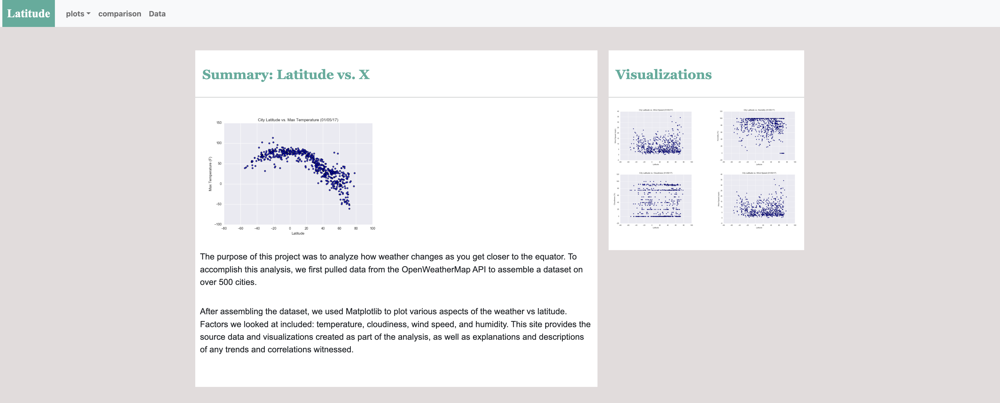
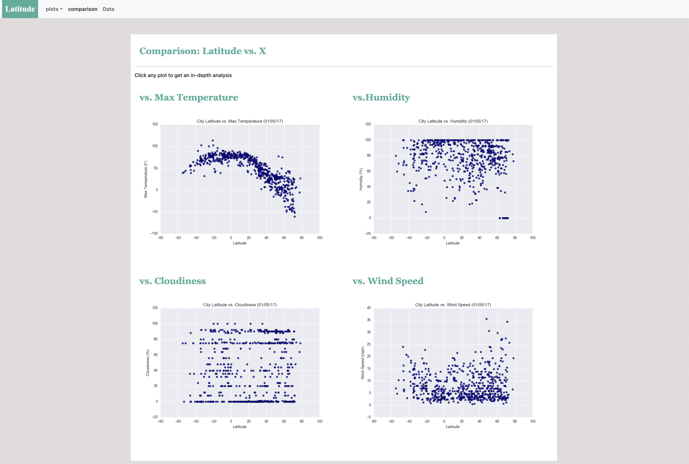
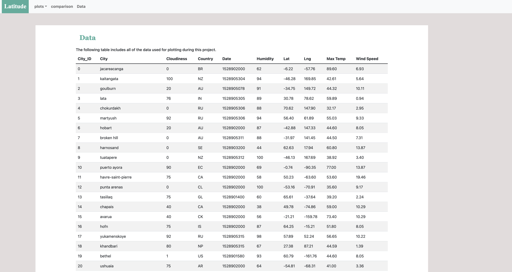
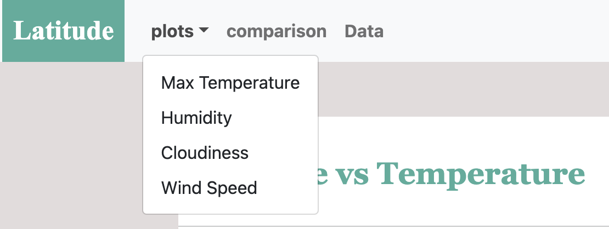

# Web Design - Web Visualization Dashboard (Latitude)

 https://robynyuan.github.io/Web-Design-Challenge/

## Background

create a dashboard to show the analysis. 

## Latitude - Latitude Analysis Dashboard with Attitude

creating a visualization dashboard website using visualizations we've created in a past project.
create individual pages for each plot and a means by one can navigate between them. These pages will contain the visualizations and their corresponding explanations. Creat a page where one can see a comparison of all of the plots, and another page where we can view the data used to build them.

The website must consist of 7 pages total, including:

* The Landing page containing:
  * An explanation of the project.
  * Links to each visualizations page. There is  a sidebar containing preview images of each plot, and clicking an image should take the user to that visualization.
  
  
* Four visualization pages, each with:
  * A descriptive title and heading tag.
  * The plot/visualization itself for the selected comparison.
  * A paragraph describing the plot and its significance.

* A ["Comparisons" page](#comparisons-page) that:
  * Contains all of the visualizations on the same page so we can easily visually compare them. 
   

* A data page that:
  * Displays a responsive table containing the data used in the visualizations.

    

The website must, at the top of every page, have a navigation menu that:

* Has the name of the site on the left of the nav which allows users to return to the landing page from any page.
* Contains a dropdown menu on the right of the navbar named "Plots" that provides a link to each individual visualization page.
* Provides two more text links on the right: "Comparisons," which links to the comparisons page, and "Data," which links to the data page.
  

